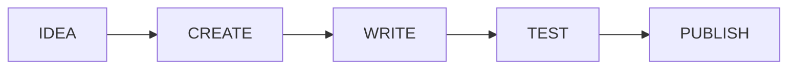

# Creating Skills

From idea to published skill.

:::tip
Want to control which targets receive your skill? See [Filtering Skills](/docs/how-to/daily-tasks/filtering-skills).
:::

## Overview



---

## Step 1: Create the Skill

```bash
skillshare new my-skill
```

This creates:
```
~/.config/skillshare/skills/my-skill/
└── SKILL.md  (with template)
```

---

## Step 2: Write the Skill

Edit the generated `SKILL.md`:

```bash
$EDITOR ~/.config/skillshare/skills/my-skill/SKILL.md
```

### Basic structure

```markdown
---
name: my-skill
description: Brief description (shown in skill lists)
---

# My Skill

What this skill does and when to use it.

## Instructions

1. Step one
2. Step two
3. Step three
```

### Good skill writing tips

**Be specific:**
```markdown
# Good
When the user asks to review code, analyze for:
- Bugs and potential issues
- Style consistency
- Performance concerns

# Bad
Review the code and make it better.
```

**Include examples:**
```markdown
## Example

User: "Review this function"
```python
def add(a, b):
    return a + b
```

Response: Suggest adding type hints...
```

**Specify when NOT to use:**
```markdown
## When NOT to Use

- Don't use for simple syntax questions
- Don't use for explaining code (use explain-code skill instead)
```

---

## Step 3: Deploy and Test

### Deploy to all targets

```bash
skillshare sync
```

### Test in your AI CLI

Try using the skill:
- Invoke explicitly: `/skill:my-skill`
- Or describe the task and see if the AI picks it up

### Iterate

Edit → sync → test until it works well.

---

## Step 4: Publish (Optional)

### Share with your team

Push to your git remote:
```bash
skillshare push -m "Add my-skill"
```

Team members can pull:
```bash
skillshare pull
```

### Share publicly

1. Create a GitHub repo for your skills
2. Push your skills directory
3. Others can install:
   ```bash
   skillshare install github.com/you/my-skills/my-skill
   ```

---

## Skill Templates

### Simple skill

```markdown
---
name: simple-skill
description: Does one thing well
---

# Simple Skill

When the user asks to do X, follow these steps:

1. First, do Y
2. Then, do Z
3. Finally, confirm completion
```

### Task-oriented skill

```markdown
---
name: code-review
description: Reviews code for quality and issues
---

# Code Review

You are a code reviewer. Analyze code for quality issues.

## What to Check

- Bugs and edge cases
- Performance issues
- Security vulnerabilities
- Code style and readability

## Output Format

For each issue found:
1. **Location**: File and line
2. **Severity**: High/Medium/Low
3. **Issue**: What's wrong
4. **Fix**: Suggested solution

## Example

[Include an example input and expected output]
```

### Target-specific skill

```markdown
---
name: claude-prompts
description: Prompt patterns specific to Claude Code
targets: [claude]
---

# Claude Prompts

Patterns that work best with Claude Code's capabilities.

## When to Use

Use when crafting prompts for Claude Code specifically.
```

When `targets` is set, the skill only syncs to matching targets — other targets won't receive it. Omit `targets` to sync everywhere.

### Process skill

```markdown
---
name: git-workflow
description: Guides through git commit workflow
---

# Git Workflow

Guide the user through proper git commit practices.

## Steps

1. **Check status**: Run `git status`
2. **Review changes**: Run `git diff`
3. **Stage files**: Add specific files, not `git add .`
4. **Write message**: Follow conventional commits
5. **Commit**: Create the commit
6. **Verify**: Run `git log -1`

## Commit Message Format

```text
type(scope): description

[optional body]
```

Types: feat, fix, docs, style, refactor, test, chore

---

## Advanced Topics

### Multiple files in a skill

A skill can contain additional files:

```
my-skill/
├── SKILL.md
├── examples/
│   └── sample.py
└── templates/
    └── component.tsx
```

Reference them in your SKILL.md:
```markdown
See the example in `examples/sample.py` for reference.
```

### Namespacing for teams

Avoid collisions with namespaced names:

```yaml
name: acme-code-review
```

### Version tracking

Add version metadata:

```yaml
---
name: my-skill
description: My skill
version: 1.0.0
author: Your Name
---
```

### License metadata

Add a `license` field so users see license info before installing:

```yaml
---
name: my-skill
description: My reusable skill
license: MIT
---
```

When present, `skillshare install` displays the license in the selection prompt and confirmation screen. This helps corporate users with compliance decisions. See [Skill Format](/docs/understand/skill-format#license) for details.

### Controlling discovery with .skillignore

When publishing a multi-skill repository, you may have internal tools or work-in-progress skills you don't want users to discover. Create a `.skillignore` file at the repo root:

```text title=".skillignore"
# Internal tooling
validation-scripts
scaffold-template

# Exclude an entire group directory
internal-tools/

# Work in progress
prompt-eval-*

# Ignore temp at any depth
**/temp

# Exclude tests but keep test-critical
test-*
!test-critical
```

`.skillignore` uses [gitignore syntax](https://git-scm.com/docs/gitignore) — supports `*`, `**`, `?`, `[abc]`, `!negation`, `/anchored`, `pattern/` (dir-only), and `\#`/`\!` escapes. A group name like `internal-tools` excludes **all** skills under that directory. Use a precise path like `internal-tools/helper` to exclude only a specific skill within a group.

Skills matching these patterns won't appear in `skillshare install <repo>` discovery. This is applied server-side (in the repo), so all users benefit automatically. See [`runkids/my-skills`](https://github.com/runkids/my-skills) for a real-world example, and [install --exclude](/docs/reference/commands/install#excluding-skills) for user-side exclusion.

### Source-root .skillignore (local)

You can also place a `.skillignore` at your **source root** (`~/.config/skillshare/skills/.skillignore`) to globally hide skills from all commands — `doctor`, `status`, `list`, `sync`, `audit`, `diff`, and `check`:

```text title="~/.config/skillshare/skills/.skillignore"
# Temporarily mute a skill without uninstalling
my-experimental-skill

# Exclude all draft skills
[Dd]raft*

# Hide an entire tracked repo
_archived-team-skills

# Ignore vendored deps at any depth
**/node_modules
*.venv
```

Both layers apply: source-root patterns affect all skills (tracked and non-tracked), while repo-level patterns affect only that repo's skills. If either layer matches, the skill is excluded.

### .skillignore.local (personal override)

If a shared repo's `.skillignore` blocks a skill you need locally, create a `.skillignore.local` in the same directory. Its patterns are appended after `.skillignore`, so `!pattern` negations override the base file:

```text title="_team-skills/.skillignore.local"
# The repo ignores private-*, but I need my own
!private-mine
```

This file should **not** be committed — add it to `.gitignore`. It works at both the source root and repo level.

---

## Checklist

Before publishing:

- [ ] Clear, specific name
- [ ] Description explains purpose
- [ ] Instructions are actionable
- [ ] Includes examples
- [ ] Tested in AI CLI
- [ ] No conflicts with existing skills

---

## See Also

- [new](/docs/reference/commands/new) — Create a skill with template
- [Skill Format](/docs/understand/skill-format) — SKILL.md structure
- [Skill Design](/docs/understand/philosophy/skill-design) — Complexity levels, determinism, CLI wrapper pattern
- [Best Practices](./best-practices.md) — Naming and organization
- [Organizing Skills](./organizing-skills.md) — Folder structure
