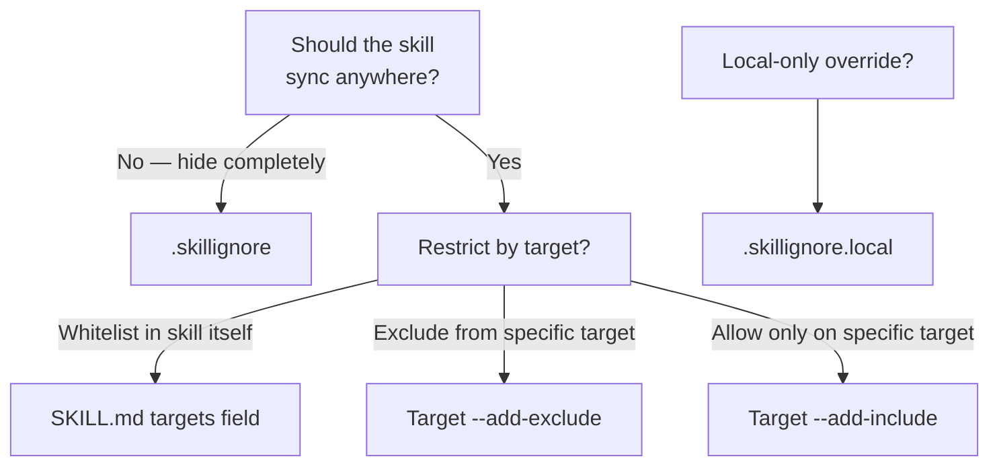

# Filtering Skills

Skillshare provides three filtering layers that control which skills reach which targets.
Pick the scenario that matches your goal.

## Sync a skill to specific targets only

Add a `targets` field (or `metadata.targets`) to the skill's SKILL.md frontmatter.
The skill will only sync to the listed targets.

```yaml
---
name: my-cursor-only-skill
targets: [cursor]
---
```

Target aliases are supported — `claude` matches both `claude` and `claude-code`.

📖 [SKILL.md targets field](/docs/understand/skill-format#targets) · [Filtering Reference](/docs/reference/filtering#skillmd-targets-field)

## Exclude specific skills from one target

Use `--add-exclude` on the target to block skills matching a glob pattern:

```bash
skillshare target cursor --add-exclude "legacy-*"
skillshare sync
```

📖 [Target filter flags](/docs/reference/commands/target#target-filters-includeexclude) · [Filtering Reference](/docs/reference/filtering#target-includeexclude-filters)

## Only allow specific skills on one target

Use `--add-include` to create a whitelist — only matching skills will sync:

```bash
skillshare target claude --add-include "team-*"
skillshare sync
```

📖 [Target filter flags](/docs/reference/commands/target#target-filters-includeexclude) · [Filtering Reference](/docs/reference/filtering#target-includeexclude-filters)

## Hide skills from all targets

Place a `.skillignore` file in your source directory. Skills matching these patterns are excluded from **all** targets at discovery time:

```text title="~/.config/skillshare/skills/.skillignore"
drafts/
experimental-*
```

📖 [.skillignore syntax](/docs/reference/appendix/file-structure#skillignore-optional) · [Filtering Reference](/docs/reference/filtering#skillignore)

## Exclude skills inside a tracked repo

Place a `.skillignore` inside the tracked repo directory. It only affects skills within that repo:

```text title="_team-repo/.skillignore"
internal-only/*
validation-scripts
```

📖 [Repo-level .skillignore](/docs/reference/appendix/file-structure#skillignore-optional)

## Local-only overrides

`.skillignore.local` is appended after `.skillignore` — last matching rule wins. Use negation patterns to un-ignore skills locally without editing the shared file:

```text title="_team-repo/.skillignore.local"
# The repo ignores private-*, but I need mine
!private-mine
```

Don't commit this file — add it to `.gitignore`.

📖 [.skillignore.local](/docs/reference/appendix/file-structure#skillignorelocal-optional)

## Which layer should I use?



## How to verify what's being filtered

| Command | What it shows |
|---------|--------------|
| `skillshare sync` | Ignored skill count and names at the bottom |
| `skillshare status --json` | Full `.skillignore` stats (patterns, ignored skills, active files) |
| `skillshare doctor` | Health check includes `.skillignore` pattern count and ignored count |
| `skillshare ui` → Sync page | Collapsible "Ignored by .skillignore" card with badge |

## See also

- [Filtering Reference](/docs/reference/filtering) — full specification of all three layers
- [Sync command](/docs/reference/commands/sync#per-target-includeexclude-filters) — filter behavior examples
- [Target command](/docs/reference/commands/target#target-filters-includeexclude) — CLI flags for include/exclude
