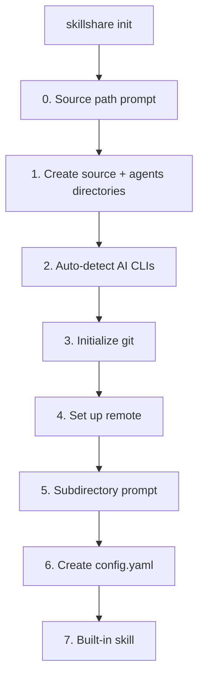
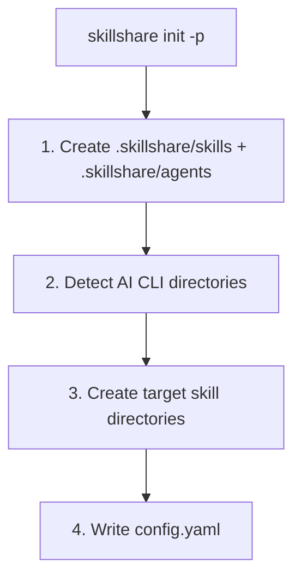

# init

First-time setup. Auto-detects installed AI CLIs and configures targets.

```bash
skillshare init              # Interactive setup
skillshare init --dry-run    # Preview without changes
```

## When to Use

- First time setting up skillshare on a machine
- Migrating to a new computer (with `--remote` to connect to existing repo)
- Adding skillshare to a project (with `--project`)
- Discovering newly installed AI CLIs (with `--discover`)

## What Happens



`init` creates the skills source directory **and** an `agents/` sibling directory in one step, so both resource kinds are ready to use immediately. The agents directory is silent — no extra prompts or flags. See [Agents](/docs/understand/agents) for the agent file format.

:::info Universal target
When any AI CLI is detected, `init` automatically recommends the **universal** target (`~/.agents/skills`). This is the shared directory used by [vercel-labs/skills](https://github.com/vercel-labs/skills) (`npx skills list`) to provide skills to all compatible agents at once.
:::

:::tip Agents source path
The agents source defaults to `<source parent>/agents` (so `~/.config/skillshare/agents/` for the default install). Set `agents_source:` in `config.yaml` to override the location. Project mode always uses `.skillshare/agents/` and does not honor `agents_source`. Agent-capable targets (Claude, Cursor, Augment, OpenCode) pick agents up automatically once you run `skillshare sync`.
:::

## Project Mode

Initialize project-level skills with `-p`:

```bash
skillshare init -p                              # Interactive
skillshare init -p --targets claude,cursor  # Non-interactive
```

### What Happens



After init, commit `.skillshare/` to git (both `skills/` and `agents/`). See [Project Setup](/docs/how-to/sharing/project-setup) for the full guide.

## Discover Mode

Re-run init on an existing setup to detect and add new AI CLI targets:

### Global

```bash
skillshare init --discover              # Interactive selection
skillshare init --discover --select codex,opencode  # Non-interactive
```

Scans for newly installed AI CLIs not yet in your config and prompts you to add them. The `universal` target (`~/.agents/skills`) is automatically recommended whenever any CLI is detected.

### Project

```bash
skillshare init -p --discover           # Interactive selection
skillshare init -p --discover --select gemini  # Non-interactive
```

Scans the project directory for new AI CLI directories (e.g., `.gemini/`) and adds them as targets.

### Discover + Mode behavior

When you combine `--discover` with `--mode`, the mode is applied **only** to targets added in this discover run.
Existing targets in config are left unchanged.

```bash
# Adds cursor with mode=copy, does not change existing targets
skillshare init --discover --select cursor --mode copy

# Project mode variant (same rule)
skillshare init -p --discover --select cursor --mode copy
```

:::tip
If you run `skillshare init` on an already-initialized setup without `--discover`, the error message will hint you to use it.
:::

## Options

| Flag | Description |
|------|-------------|
| `--source, -s <path>` | Custom source directory (interactive mode prompts if not set) |
| `--remote <url>` | Set git remote (implies `--git`; auto-pulls if remote has skills; skips built-in skill prompt when remote has skills) |
| `--project, -p` | Initialize project-level skills in current directory |
| `--copy-from, -c <name\|path>` | Copy skills from a specific CLI or path |
| `--no-copy` | Start with empty source (skip copy prompt) |
| `--targets, -t <list>` | Comma-separated target names |
| `--all-targets` | Add all detected targets |
| `--no-targets` | Skip target selection |
| `--mode, -m <mode>` | Set default mode for newly configured targets (`merge`, `copy`, `symlink`). With `--discover`, affects only newly added targets. |
| `--git` | Initialize git without prompting |
| `--no-git` | Skip git initialization |
| `--skill` | Install built-in skillshare skill without prompting (adds `/skillshare` to AI CLIs) |
| `--no-skill` | Skip built-in skill installation |
| `--discover, -d` | Detect and add new AI CLI targets to existing config |
| `--select <list>` | Comma-separated targets to add (requires `--discover`) |
| `--config local` | Gitignore `config.yaml` so each developer manages own targets (project mode only). See [Centralized Skills Repo](/docs/how-to/recipes/centralized-skills-repo) recipe. |
| `--subdir <name>` | Use a subdirectory as the source path (e.g. `skills`) |
| `--dry-run, -n` | Preview without changes |

`init` sets your starting mode policy. You can always fine-tune per target later:

```bash
skillshare target cursor --mode copy
skillshare sync
```

## Source Subdirectory

By default, `init --remote` treats the entire git repo root as the skills source. If your repo also contains non-skill files (README, CI config, dotfiles, etc.), you can store skills in a subdirectory instead:

```
# Without --subdir: repo root = source (all files are skills)
~/.config/skillshare/skills/          ← git repo root = source
  ├── my-skill/
  └── another-skill/

# With --subdir skills: source points to a subdirectory
~/.config/skillshare/skills/          ← git repo root
  ├── README.md
  ├── .github/
  └── skills/                         ← source points here
      ├── my-skill/
      └── another-skill/
```

Typical use case: embedding skills inside an existing dotfiles or monorepo instead of a dedicated skills-only repo.

```bash
# Interactive: prompts during init
skillshare init --remote git@github.com:you/dotfiles.git

# Non-interactive: specify directly
skillshare init --remote git@github.com:you/dotfiles.git --subdir skills
```

## Common Scenarios

### Remote setup (pick one)

Interactive (recommended for first-time setup when you want guided prompts):

```bash
skillshare init --remote git@github.com:you/my-skills.git
```

Non-interactive (no prompts, auto-detect installed targets):

```bash
skillshare init --remote git@github.com:you/my-skills.git --no-copy --all-targets --no-skill
```

Non-interactive (no prompts, and import existing Claude skills now):

```bash
skillshare init --remote git@github.com:you/my-skills.git --copy-from claude --all-targets --no-skill
```

### Centralized skills repo

```bash
# Creator: set up shared repo with local config
skillshare init -p --config local --targets claude

# Teammate: clone and auto-detect shared repo
git clone <repo> && cd <repo>
skillshare init -p
skillshare target add myproject ~/DEV/myproject/.claude/skills -p
```

### Other scenarios

```bash
# Standard setup (auto-detect everything)
skillshare init

# Use existing skills directory
skillshare init --source ~/.config/skillshare/skills

# Project-level setup
skillshare init -p
skillshare init -p --targets claude,cursor

# Fully non-interactive setup
skillshare init --no-copy --all-targets --git --skill

# Start with copy mode defaults for newly added targets
skillshare init --mode copy

# Add newly installed CLIs to existing config
skillshare init --discover
skillshare init -p --discover

# Add a newly discovered target and force copy mode only for that new target
skillshare init --discover --select cursor --mode copy
```
