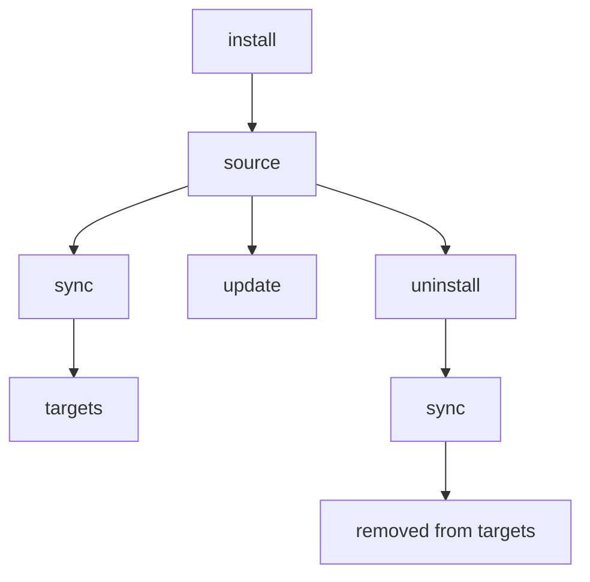

# install

Add skills from GitHub repos, git URLs, or local paths.

## Overview



## When to Use

- Add a new skill from GitHub, GitLab, Bitbucket, Azure DevOps, or a local path
- Install an organization's shared skill repository (with `--track`)
- Re-install or update an existing skill (with `--update` or `--force`)

---

## Quick Examples

```bash
# From GitHub (shorthand)
skillshare install anthropics/skills/skills/pdf

# Browse available skills in a repo
skillshare install anthropics/skills

# From local path
skillshare install ~/Downloads/my-skill

# As tracked repo (for team sharing)
skillshare install github.com/team/skills --track

# Install into a subdirectory (organize by category)
skillshare install ~/my-skill --into frontend

# Install all skills from config (no arguments)
skillshare install
```

## Source Formats

### GitHub Shorthand

Use `owner/repo` format — automatically expands to `github.com/owner/repo`:

```bash
skillshare install anthropics/skills                    # Browse mode
skillshare install anthropics/skills/skills/pdf         # Direct install
skillshare install ComposioHQ/awesome-claude-skills     # Another repo
```

### GitLab / Bitbucket / Other Hosts

Use `domain/owner/repo` format for non-GitHub hosts:

```bash
skillshare install gitlab.com/user/repo                 # GitLab
skillshare install bitbucket.org/team/skills            # Bitbucket
skillshare install git.company.com/team/skills          # Self-hosted
```

Full URLs and SSH also work:

```bash
skillshare install https://gitlab.com/user/repo.git
skillshare install git@gitlab.com:user/repo.git
```

:::tip Self-managed GitLab on custom domains
Hosts containing `gitlab` or `jihulab` in the name are automatically detected with nested subgroup support. For other self-managed GitLab instances on custom domains (e.g., `git.company.com`), add the hostname to [`gitlab_hosts`](/docs/reference/targets/configuration#gitlab_hosts) in your config so skillshare treats the full URL path as the repository. Without config, you can append `.git` as a workaround: `git.company.com/team/frontend/ui.git`.
:::

### Azure DevOps

Use the `ado:` shorthand or full Azure DevOps URLs:

```bash
# Shorthand (ado:org/project/repo)
skillshare install ado:myorg/myproject/myrepo
skillshare install ado:myorg/myproject/myrepo/skills/react    # With subdir

# Full HTTPS URL
skillshare install https://dev.azure.com/myorg/myproject/_git/myrepo

# Legacy format (auto-normalized)
skillshare install https://myorg.visualstudio.com/myproject/_git/myrepo

# SSH
skillshare install git@ssh.dev.azure.com:v3/myorg/myproject/myrepo
```

## Discovery Mode (Browse Skills)

When you don't specify a path, skillshare clones the repo, scans for skills, and presents an interactive picker:

```bash
skillshare install anthropics/skills
```

<p>
  
</p>

Discovery scans all directories for `SKILL.md` files, skipping only `.git`. This means skills inside hidden directories like `.curated/` or `.system/` are discovered automatically. When multiple skills are found, the selection prompt groups them by directory for easier browsing.

If the repository contains a `.skillignore` file at its root, matching skills are automatically excluded from discovery. See [.skillignore](#skillignore) below.

If a skill's `SKILL.md` includes a `license:` frontmatter field, the license is shown in the selection prompt (e.g., `my-skill (MIT)`) and in the confirmation screen for single-skill installs.

**Tip**: Use `--dry-run` to preview without installing:
```bash
skillshare install anthropics/skills --dry-run
```

## Selective Install (Non-Interactive)

Pick specific skills from a multi-skill repo without prompts. The `--skill` flag supports **fuzzy matching** and **glob patterns** — if an exact name isn't found, it tries glob matching (`*`, `?`, `[...]`), then falls back to the closest substring match:

```bash
# Install specific skills by name (exact or fuzzy)
skillshare install anthropics/skills -s pdf,commit

# Install skills matching a glob pattern
skillshare install anthropics/skills -s "core-*"

# Install all discovered skills
skillshare install anthropics/skills --all

# Auto-accept (same as --all for multi-skill repos)
skillshare install anthropics/skills -y

# Combine with other flags
skillshare install anthropics/skills -s pdf --dry-run
skillshare install anthropics/skills --all -p
```

Glob matching is case-insensitive: `"Core-*"` matches `core-auth`, `CORE-DB`, etc.

:::tip Shell glob protection
Always quote glob patterns (`"core-*"`) to prevent your shell from expanding `*` into file names in the current directory.
:::

Useful for CI/CD pipelines and scripted workflows.

## Direct Install (Specific Path)

Provide the full path to install immediately:

```bash
# GitHub with subdirectory
skillshare install anthropics/skills/skills/pdf
skillshare install google-gemini/gemini-cli/packages/core/src/skills/builtin/skill-creator

# Fuzzy subdirectory — if exact path doesn't exist, matches by skill name
skillshare install runkids/my-skills/vue-best-practices

# Full URL
skillshare install github.com/user/repo/path/to/skill

# SSH URL
skillshare install git@github.com:user/repo.git

# SSH URL with subdirectory (use // separator)
skillshare install git@github.com:user/repo.git//path/to/skill

# Local path
skillshare install ~/Downloads/my-skill
skillshare install /absolute/path/to/skill
```

:::tip Fuzzy subdirectory resolution
When specifying a subdirectory path like `owner/repo/skill-name`, if the exact path doesn't exist in the repo, skillshare scans all `SKILL.md` files and matches by directory basename. If multiple skills share the same name, an ambiguity error is shown with full paths so you can specify the exact one.
:::

## Install from Config (No Arguments)

When run without a source argument, `skillshare install` reads the `skills:` section from `config.yaml` and installs all listed remote skills that don't already exist locally:

```bash
# Global — reads ~/.config/skillshare/config.yaml
skillshare install

# Project — reads .skillshare/config.yaml
skillshare install -p
```

This makes `config.yaml` a **portable skill manifest** — share it to reproduce the same skill setup on any machine:

```bash
# New machine setup
skillshare install       # Installs all skills from config
skillshare sync          # Sync to targets

# New team member onboarding
git clone github.com/team/project && cd project
skillshare install -p    # Install all remote skills from project config
skillshare sync
```

Skills with `tracked: true` are cloned with full git history (same as `--track`), so `skillshare update` works correctly. Skills already present on disk are skipped.

:::tip push/pull vs install from config
`push`/`pull` syncs actual skill **files** via git. `install` from config re-downloads from **source URLs**. They're complementary — see [Cross-Machine Sync](/docs/how-to/sharing/cross-machine-sync#alternative-install-from-config) for when to use which.
:::

When using no-arg install, `--name`, `--into`, `--track`, `--skill`, `--exclude`, `--all`, `--yes`, and `--update` are not supported (they require a source argument). `--dry-run`, `--force`, `--skip-audit`, and threshold overrides (`--audit-threshold` / `--threshold` / `-T`) work as expected.

## Project Mode

Install skills into a project's `.skillshare/skills/` directory:

```bash
# Install a skill into the project
skillshare install anthropics/skills/skills/pdf -p

# Install into a subdirectory within the project
skillshare install anthropics/skills -s pdf --into tools -p
# → .skillshare/skills/tools/pdf/

# Install all remote skills from config (for new team members)
skillshare install -p
```

### How It Differs

| | Global | Project (`-p`) |
|---|---|---|
| Destination | `~/.config/skillshare/skills/` | `.skillshare/skills/` |
| `--track` | Supported | Supported |
| Config update | Auto-reconciles `config.yaml` `skills:` | Auto-reconciles `.skillshare/config.yaml` `skills:` |
| No-arg install | Installs all skills listed in config | Installs all skills listed in config |

**Tracked repos in project mode** work the same as global — the repo is cloned with `.git` preserved and added to `.skillshare/.gitignore` (which also ignores `.skillshare/logs/` and `.skillshare/trash/` by default). The `tracked: true` flag is auto-recorded in `.skillshare/config.yaml`:

```bash
skillshare install github.com/team/skills --track -p
skillshare sync
```

See [Project Setup](/docs/how-to/sharing/project-setup) for the full guide.

## Options

| Flag | Short | Description |
|------|-------|-------------|
| `--name <name>` | | Override installed name when exactly one skill is installed |
| `--into <dir>` | | Install into subdirectory (e.g. `--into frontend` or `--into frontend/react`) |
| `--force` | `-f` | Overwrite existing skill; override audit blocking and cross-path duplicate check |
| `--update` | `-u` | Update if exists (git pull or reinstall) |
| `--branch <name>` | `-b` | Git branch to clone from (default: remote default branch) |
| `--track` | `-t` | Keep `.git` for tracked repos |
| `--skill` | `-s` | Select specific skills from multi-skill repo (comma-separated; supports glob patterns like `core-*`) |
| `--exclude` | | Skip specific skills during install (comma-separated; supports glob patterns like `test-*`) |
| `--all` | | Install all discovered skills without prompting |
| `--yes` | `-y` | Auto-accept all prompts (CI/CD friendly) |
| `--skip-audit` | | Skip security audit for this install |
| `--audit-threshold <t>`, `--threshold <t>` | `-T` | Override audit block threshold for this command (`critical|high|medium|low|info`; shorthand: `c|h|m|l|i`, plus `crit`, `med`) |
| `--audit-verbose` | | Show full audit findings per skill (default: compact summary) |
| `--project` | `-p` | Install into project `.skillshare/skills/` |
| `--global` | `-g` | Install into global `~/.config/skillshare/skills/` |
| `--dry-run` | `-n` | Preview only |
| `--json` | | Output as JSON (implies `--force` and `--all`, non-interactive) |

## JSON Output

```bash
skillshare install anthropics/skills --json
```

```json
{
  "source": "anthropics/skills",
  "tracked": false,
  "dry_run": false,
  "skills": ["pdf", "commit", "review"],
  "failed": [],
  "duration": "2.345s"
}
```

When `--into` is used, the `into` field is included:

```bash
skillshare install anthropics/skills --json --into frontend
```

```json
{
  "source": "anthropics/skills",
  "tracked": false,
  "dry_run": false,
  "into": "frontend",
  "skills": ["pdf", "commit"],
  "failed": [],
  "duration": "1.890s"
}
```

## Duplicate Detection

skillshare automatically detects when you're about to install something that already exists:

### Same-repo reinstall

If a skill already exists and was installed from the **same repo**, skillshare skips it with a warning instead of failing:

```bash
skillshare install anthropics/skills/skills/pdf
# ✓ Installed pdf

skillshare install anthropics/skills/skills/pdf
# ⊘ pdf — already installed from same repo
```

Use `--update` to refresh, or `--force` to overwrite.

### Cross-path duplicate

If a repo is already installed at one location and you try to install it at a **different** location, skillshare blocks the operation:

```bash
# First install (into a subdirectory)
skillshare install runkids/feature-radar --into feature-radar

# Later, forget about the first install
skillshare install runkids/feature-radar
# ✗ this repo is already installed at skills/feature-radar/scan (and 2 more)
#   Use 'skillshare update' to refresh, or reinstall with --force to allow duplicates
```

This prevents accidental duplicates across different paths. Use `--force` to allow it intentionally.

### Conflict with different repo

If the destination directory exists but was installed from a **different** repo, the error message includes the original source:

```bash
skillshare install owner/repo-b --name my-skill
# ✗ my-skill already exists (installed from https://github.com/owner/repo-a.git).
#   To overwrite: skillshare install owner/repo-b --name my-skill --force
```

The `--force` hint always includes the correct flags (including `--into` if applicable).

## Common Scenarios

**Install with custom name:**
```bash
skillshare install google-gemini/gemini-cli/.../skill-creator --name my-creator
# Installed as: ~/.config/skillshare/skills/my-creator/
```

`--name` only works when install resolves to a single skill.
In `--track` mode, custom names are stored as tracked repo directories (auto-prefixed with `_`) and must not contain path separators or `..`.

```bash
# ✅ Single skill (works)
skillshare install comeonzhj/Auto-Redbook-Skills --name haha

# ❌ Multiple discovered skills (errors)
skillshare install anthropics/skills --name my-skill
```

**Force overwrite existing:**
```bash
skillshare install ~/my-skill --force
```

**Update existing skill:**
```bash
# By skill name (uses stored source)
skillshare install pdf --update

# By source URL
skillshare install anthropics/skills/skills/pdf --update
```

**Install into a subdirectory:**
```bash
# Organize by category
skillshare install ~/my-skill --into frontend
# → ~/.config/skillshare/skills/frontend/my-skill/

# Multi-level nesting
skillshare install anthropics/skills -s pdf --into frontend/react
# → ~/.config/skillshare/skills/frontend/react/pdf/

# After sync, target shows flat name: frontend__my-skill, frontend__react__pdf
```

See [Organizing Skills](/docs/how-to/daily-tasks/organizing-skills) for folder strategies.

**Install from a specific branch:**
```bash
# Regular install from a branch
skillshare install github.com/team/skills --branch develop --all

# Track a specific branch
skillshare install github.com/team/skills --track --branch frontend

# Same repo, different branches (use --name to avoid collision)
skillshare install github.com/team/skills --track --branch frontend --name team-frontend
skillshare install github.com/team/skills --track --branch backend --name team-backend
```

**Install team repo (tracked):**
```bash
skillshare install anthropics/skills --track
```

<p>
  
</p>

## Private Repositories

### SSH (recommended)

SSH is the simplest method — if your SSH key is configured, it just works:

```bash
skillshare install git@github.com:org/private-skills.git --track
skillshare install git@gitlab.com:org/skills.git --track
skillshare install git@bitbucket.org:team/skills.git --track
skillshare install git@ssh.dev.azure.com:v3/org/project/skills --track

# With subdirectory
skillshare install git@github.com:org/skills.git//frontend-react
```

### HTTPS with Token

Set the appropriate environment variable and use a regular HTTPS URL. skillshare automatically detects the token and injects it during clone:

```bash
export GITHUB_TOKEN=ghp_your_token
skillshare install https://github.com/org/private-skills.git --track
```

| Platform | Env Var | Token Type |
|----------|---------|------------|
| GitHub | `GITHUB_TOKEN` | Personal access token (`repo` scope) |
| GitLab | `GITLAB_TOKEN` | Personal access or CI job token |
| Bitbucket | `BITBUCKET_TOKEN` | Repository token, or app password (with `BITBUCKET_USERNAME`) |
| Azure DevOps | `AZURE_DEVOPS_TOKEN` | Personal Access Token (Code: Read scope) |
| Any host | `SKILLSHARE_GIT_TOKEN` | Generic fallback |

Platform-specific variables take priority over `SKILLSHARE_GIT_TOKEN`.

Official token documentation:
- GitHub: [Managing your personal access tokens](https://docs.github.com/en/authentication/keeping-your-account-and-data-secure/managing-your-personal-access-tokens)
- GitLab: [Token overview](https://docs.gitlab.com/security/tokens/)
- Bitbucket: [Access tokens](https://support.atlassian.com/bitbucket-cloud/docs/access-tokens/)
- Azure DevOps: [Use Personal Access Tokens](https://learn.microsoft.com/en-us/azure/devops/organizations/accounts/use-personal-access-tokens-to-authenticate?view=azure-devops)

For Bitbucket app passwords, also set your username:

```bash
export BITBUCKET_USERNAME=your_bitbucket_username
export BITBUCKET_TOKEN=your_app_password
skillshare install https://bitbucket.org/team/skills.git --track
```

### CI/CD Examples

**GitHub Actions:**

```yaml
- name: Install shared skills
  env:
    GITHUB_TOKEN: ${{ secrets.GITHUB_TOKEN }}
  run: skillshare install https://github.com/org/skills.git --track
```

**GitLab CI:**

```yaml
install-skills:
  script:
    - skillshare install https://gitlab.com/org/skills.git --track
  variables:
    GITLAB_TOKEN: $CI_JOB_TOKEN
```

**Bitbucket Pipelines:**

```yaml
- step:
    name: Install shared skills
    script:
      - skillshare install https://bitbucket.org/team/skills.git --track
    env:
      BITBUCKET_USERNAME: $BITBUCKET_USERNAME   # for app passwords
      BITBUCKET_TOKEN: $BITBUCKET_TOKEN
```

**Azure Pipelines:**

```yaml
- script: skillshare install https://dev.azure.com/org/project/_git/skills --track
  env:
    AZURE_DEVOPS_TOKEN: $(System.AccessToken)
```

## Security Scanning

Every skill is automatically scanned for security threats during installation:

- Findings at or above `audit.block_threshold` **block installation** (default: `CRITICAL`)
- Lower findings are shown as warnings and include risk score context
- `audit.block_threshold` only controls block level; it does **not** disable scanning
- There is no config switch to always skip audit; use `--skip-audit` per command when needed
- You can override threshold per command with `--audit-threshold`, `--threshold`, or `-T`

Threshold config example:

```yaml
audit:
  block_threshold: HIGH
```

```bash
# Blocked — critical threat detected
skillshare install evil-skill
# → Installation blocked at active threshold. Use --force to override.

# Force install despite warnings
skillshare install suspicious-skill --force

# Skip scan entirely (use with caution)
skillshare install suspicious-skill --skip-audit

# Per-command threshold override (same meaning)
skillshare install suspicious-skill --audit-threshold high
skillshare install suspicious-skill --threshold high
skillshare install suspicious-skill -T h
```

Use `--force` to override block decisions, or `--skip-audit` to bypass scanning entirely. See [audit](/docs/reference/commands/audit) for scanning details.

The install decision uses **finding severity vs threshold**. Risk score/label is reported for context and does not by itself block installs. By default, audit findings are shown as a compact summary (grouped by severity and message). Use `--audit-verbose` to see the full list.

### Tracked Repo Audit Gate (`--track`)

Tracked repos use the same threshold model, but the scan scope and failure handling are stricter:

- Fresh `--track` install scans the **entire cloned repository** (not just one skill folder)
- Findings at/above threshold block install unless `--force` is used
- On blocked fresh install, skillshare automatically removes the cloned repo from source
- If automatic cleanup fails, install returns an explicit error and tells you to remove the path manually

Tracked repo updates through install (`skillshare install <repo> --track --update`) are audited after `git pull`:

- skillshare captures a pre-pull commit hash first
- If hash capture fails, update aborts immediately (fail-closed)
- If findings at/above threshold are detected, update is rolled back to the pre-pull commit
- If rollback fails, command exits with a warning that malicious content may remain

### `--force` vs `--skip-audit`

Both can unblock installation, but they do different things:

| Flag | Audit execution | What happens |
|------|------------------|--------------|
| `--force` | Audit still runs | Findings are still generated/logged; install continues even if threshold is hit |
| `--skip-audit` | Audit is skipped | No scan is performed for this install |

Recommended usage:

- Prefer `--force` when you still want visibility into findings.
- Use `--skip-audit` only when you intentionally need to bypass scanning.
- If both are set, `--skip-audit` takes precedence in practice (scan is skipped).

## Excluding Skills

### `--exclude` flag

Skip specific skills when installing from a multi-skill repo. Supports both exact names and **glob patterns**:

```bash
# Install all except specific skills
skillshare install anthropics/skills --all --exclude cli-sentry,delayed-command

# Exclude by glob pattern
skillshare install anthropics/skills --all --exclude "test-*"

# Works with -y too
skillshare install org/skills -y --exclude internal-tool

# Combine with --skill for fine-grained control
skillshare install org/skills -s pdf,commit,docs --exclude docs
```

When skills are excluded, a message shows what was skipped: `Excluded 2 skill(s): cli-sentry, delayed-command`.

:::note Requires multi-skill discovery
`--exclude` only works when installing from a **git repo** that contains multiple skills. It works with `--all`, `--yes`, `--skill`, and interactive selection modes. For direct installs (local paths or single-skill git URLs), `--exclude` is not applicable — a warning is shown if specified.
:::

### .skillignore {#skillignore}

Repository maintainers can create a `.skillignore` file at the repo root to hide skills from discovery. Users installing from the repo will never see these skills in the selection prompt.

```text title=".skillignore"
# Internal tooling — not for public use
validation-scripts
scaffold-template

# Exclude all test/eval skills
prompt-eval-*

# Exclude an entire group directory
internal-tools
```

**Real-world example** — [`runkids/my-skills`](https://github.com/runkids/my-skills) uses `.skillignore` to exclude non-skill directories and internal tooling:

```text title=".skillignore"
skillshare
feature-radar
```

Combined with `--exclude`, users can further narrow the selection:

```bash
skillshare install runkids/my-skills --exclude seo
```

**Format** — uses [gitignore syntax](https://git-scm.com/docs/gitignore):

| Pattern | Example | Behavior |
|---------|---------|----------|
| Exact name | `validation-scripts` | Matches a skill at that path |
| Group match | `feature-radar` | Matches **all** skills under `feature-radar/` |
| Precise path | `feature-radar/feature-radar` | Only that specific skill |
| `*` wildcard | `prompt-eval-*` | Matches one segment (does not cross `/`) |
| `**` | `**/temp` | Matches at any directory depth |
| `?` | `?.md` | Matches a single character |
| `[abc]` | `[Tt]est` | Character class |
| `!pattern` | `!important` | Negation — un-ignore a previously matched skill |
| `/pattern` | `/root-only` | Anchored to the `.skillignore` location |
| `pattern/` | `build/` | Directory-only match |
| `\#`, `\!` | `\#file` | Escaped literal characters |

Lines starting with `#` are comments. Empty lines are ignored.

**Recommended scenarios:**
- Publishing a multi-skill repository while hiding internal tools or work-in-progress skills
- Using a monorepo with grouped skill directories and excluding an entire group (for example, `internal-tools`)
- Enforcing maintainer-level visibility rules so all installers never discover certain skills

**Not a fit:**
- Direct local-path installs (these skip discovery)
- Single-skill direct installs (similar to `--exclude`, which is ignored for direct install paths)

`.skillignore` is applied during git repo discovery, so it affects all discovery-based install paths: `--all`, `--skill`, `--yes`, and interactive selection. It does **not** apply to direct local-path installs (which skip discovery entirely).

:::tip .skillignore scope
**Repo-level** `.skillignore` (in a repository root) controls which skills are discoverable when users install from your repo. After installation, tracked repos retain their `.skillignore` — it is also respected by `doctor`, `status`, `list`, `sync`, `audit`, `diff`, and `check`.

**Source-root** `.skillignore` (`~/.config/skillshare/skills/.skillignore`) applies globally to all skills — tracked and non-tracked. Use it to temporarily mute skills or exclude patterns (e.g., `draft-*`) without uninstalling.
:::

### `.skillignore` vs `--exclude`

| | `.skillignore` | `--exclude` |
|---|---|---|
| **Who controls it** | Repo maintainer | Installing user |
| **Where it lives** | `.skillignore` in repo root | CLI flag |
| **When it applies** | During discovery (before selection) | After discovery (before prompt) |
| **Scope** | All users installing from this repo | This install only |
| **Requires** | Git repo with multiple skills | Git repo with multiple skills |

## After Installing

Always sync to distribute to targets:

```bash
skillshare install anthropics/skills/skills/pdf
skillshare sync  # ← Don't forget!
```

## See Also

- [list](/docs/reference/commands/list) — View installed skills
- [update](/docs/reference/commands/update) — Update skills or tracked repos
- [upgrade](/docs/reference/commands/upgrade) — Upgrade CLI and built-in skill
- [uninstall](/docs/reference/commands/uninstall) — Remove skills
- [sync](/docs/reference/commands/sync) — Sync skills to targets
- [Organization-Wide Skills](/docs/how-to/sharing/organization-sharing) — Organization sharing with tracked repos
