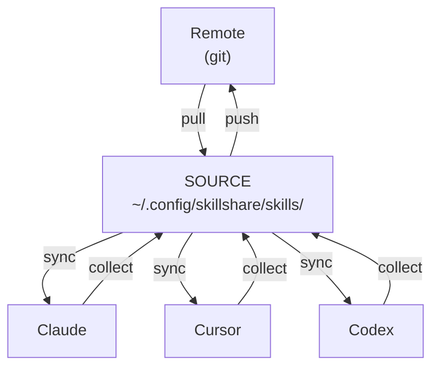
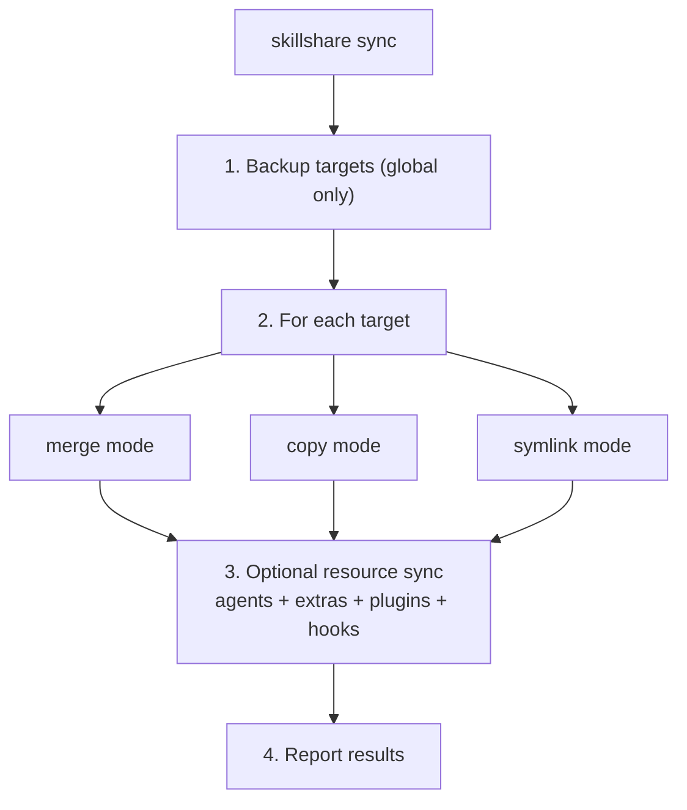
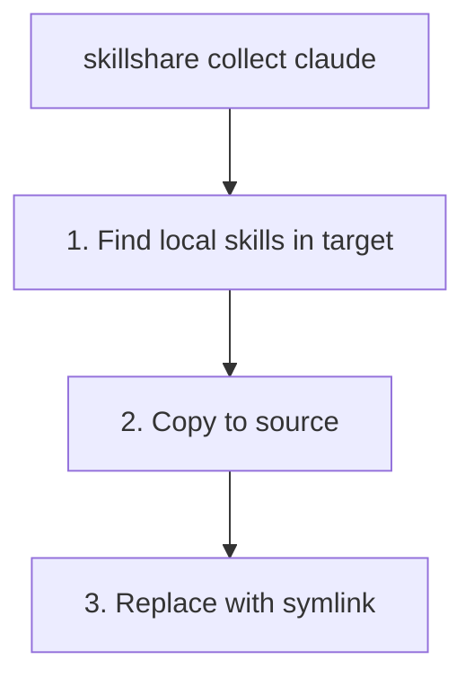
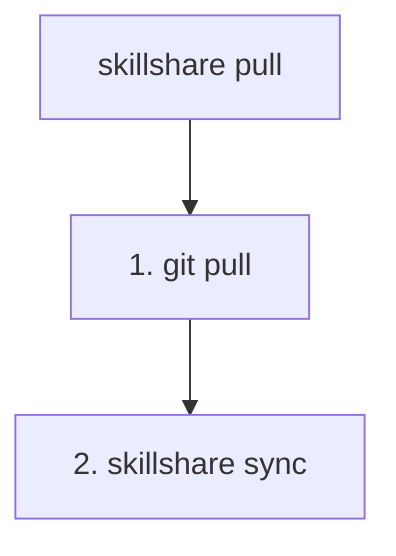
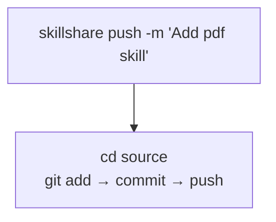
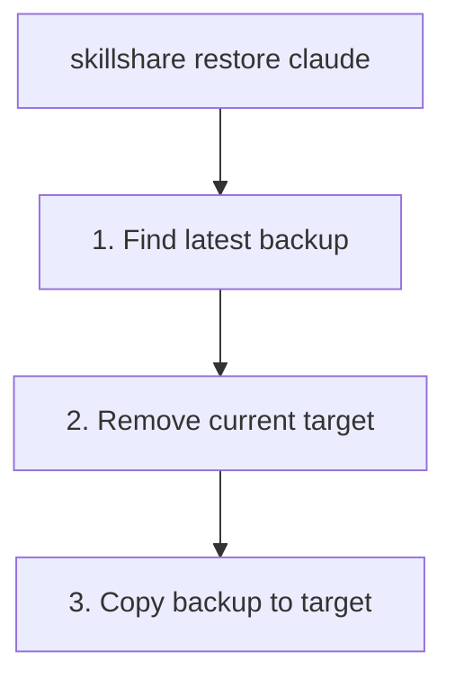
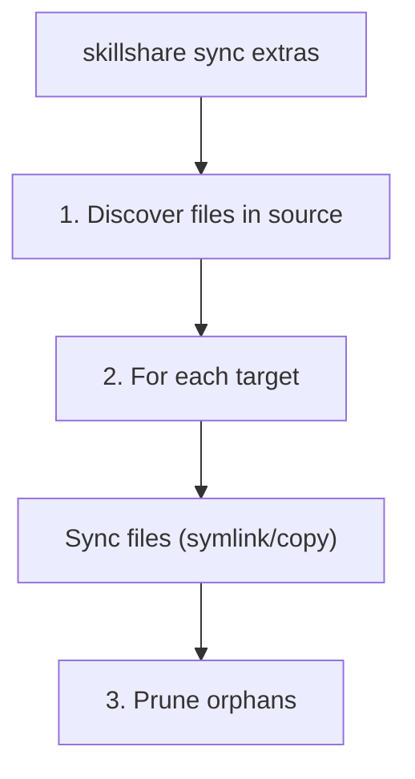

# sync

Push skills from source to all targets.

:::info Why is sync a separate command?
Operations like `install` and `uninstall` only modify source — sync propagates to targets. This lets you batch changes, preview with `--dry-run`, and control when targets update. See [Why Sync is a Separate Step](/docs/understand/source-and-targets#why-sync-is-a-separate-step).
:::

## When to Use

- After installing, uninstalling, or editing skills — propagate changes to all targets
- After changing a target's sync mode — apply the new mode
- Periodically to ensure all targets are in sync

## Command Overview

| Type | Command | Direction |
|------|---------|-----------|
| **Local sync** | `sync` / `collect` | Source ↔ Targets |
| **Remote sync** | `push` / `pull` | Source ↔ Git Remote |

- `sync` = Distribute from Source to Targets
- `collect` = Collect from Targets back to Source
- `push` = Push to git remote
- `pull` = Pull from git remote and sync

## Overview



| Command | Direction | Description |
|---------|-----------|-------------|
| `sync` | Source → Targets | Push skills to all targets |
| `collect <target>` | Target → Source | Collect skills from target to source |
| `push` | Source → Remote | Commit and push to git |
| `pull` | Remote → Source → Targets | Pull from git, then sync |

---

## Project Mode

When `.skillshare/config.yaml` exists in the current directory, sync auto-detects project mode:

```bash
cd my-project/
skillshare sync          # Auto-detected project mode
skillshare sync -p       # Explicit project mode
```

**Project sync** defaults to merge mode (per-skill symlinks), but each target can be set to copy or symlink mode via `skillshare target <name> --mode copy -p`. Backup is not created (project targets are reproducible from source).

```
.skillshare/skills/                 .claude/skills/
├── my-skill/          ────────►    ├── my-skill/ → (symlink)
├── pdf/               ────────►    ├── pdf/      → (symlink)
└── ...                             └── local/    (preserved)
```

---

## Sync

Push skills from source to all targets.

```bash
skillshare sync              # Sync skills to all targets
skillshare sync agents       # Sync agents only
skillshare sync --all        # Sync skills + agents + extras + plugins + hooks
skillshare sync --dry-run    # Preview changes
skillshare sync -n           # Short form
skillshare sync --force      # Overwrite all managed skills
skillshare sync -f           # Short form
```

| Flag | Short | Description |
|------|-------|-------------|
| `--all` | | Also sync agents, extras, plugins, and hooks after skills |
| `--dry-run` | `-n` | Preview changes without writing |
| `--force` | `-f` | Overwrite all managed entries regardless of checksum (copy mode) or replace existing directories with symlinks (merge mode) |
| `--json` | | Output as JSON |

### JSON Output

```bash
skillshare sync --json
```

```json
{
  "targets": 3,
  "linked": 12,
  "local": 2,
  "updated": 0,
  "pruned": 1,
  "ignored_count": 2,
  "ignored_skills": ["_team/vendor/lib", "test-draft"],
  "dry_run": false,
  "duration": "0.234s",
  "details": [
    {
      "name": "claude",
      "mode": "merge",
      "linked": 8,
      "local": 2,
      "updated": 0,
      "pruned": 1
    },
    {
      "name": "cursor",
      "mode": "merge",
      "linked": 4,
      "local": 0,
      "updated": 0,
      "pruned": 0
    }
  ],
  "plugins": [
    {
      "name": "demo",
      "target": "codex",
      "rendered": "/home/user/.agents/plugins/demo",
      "installed": true
    }
  ],
  "hooks": [
    {
      "name": "audit",
      "target": "claude",
      "root": "/home/user/.claude/hooks/skillshare/audit",
      "merged": true
    }
  ]
}
```

When `--all` is used, JSON output can also include top-level `extras`, `plugins`, and `hooks` sections describing the follow-on sync work after the core skills pass.

Overall success is still possible when those follow-on sections contain warnings or target-specific no-op rows. Example: a Claude-only hook bundle synced with `--target all` can produce a successful Claude result plus a Codex warning row saying `no codex hooks defined`.

The `ignored_count` and `ignored_skills` fields show skills excluded by `.skillignore` (and `.skillignore.local` if present). These are filtered at discovery time and never reach any target. When `.skillignore.local` is active, the text output includes a `.local` source hint. See [.skillignore](/docs/reference/appendix/file-structure#skillignore-optional) for pattern syntax.

### What Happens



## `sync --all` resource coverage

`skillshare sync --all` is the umbrella command for these source-managed resource kinds:

- `skills`
- `agents`
- `extras`
- `plugins`
- `hooks`

The resource-specific flows remain separate:

- Skills and agents sync through target path management.
- Extras sync file trees to configured targets.
- Plugins render into Claude/Codex marketplace roots and may install/enable natively.
- Hooks render scripts into managed roots and merge references back into Claude/Codex config files.

See [plugins](./plugins.md) and [hooks](./hooks.md) for the native integration details.

### Example Output

<p>
  
</p>

---

## Collect

Collect skills from a target back to source.

```bash
skillshare collect claude           # Collect from Claude
skillshare collect claude --dry-run # Preview
skillshare collect --all            # Collect from all targets
```

**When to use**: You created/edited a skill directly in a target (e.g., `~/.claude/skills/`) and want to bring it to source.



**After collecting:**
```bash
skillshare collect claude
skillshare sync  # ← Distribute to other targets
```

---

## Pull

Pull from git remote and sync to all targets.

```bash
skillshare pull              # Pull from git remote
skillshare pull --dry-run    # Preview
```

**When to use**: You pushed changes from another machine and want to sync them here.



---

## Push

Commit and push source to git remote.

```bash
skillshare push                  # Auto-generated message
skillshare push -m "Add pdf"     # Custom message
```



**Conflict handling:**
- If remote is ahead, `push` fails → run `pull` first

---

## Dotfiles Manager Compatibility

If you use a dotfiles manager (GNU Stow, chezmoi, yadm, bare-git) that symlinks your source or target directories, skillshare handles it transparently:

```
# Dotfiles manager creates:
~/.config/skillshare/skills/ → ~/dotfiles/ss-skills/     # symlinked source
~/.claude/skills/            → ~/dotfiles/claude-skills/  # symlinked target
```

- **Symlinked source** — all commands (`sync`, `update`, `uninstall`, `list`, `diff`, `install`) resolve the symlink before walking, so skills are discovered correctly. Chained symlinks (link → link → real dir) also work.
- **Symlinked target** — `sync` detects that the target symlink was **not** created by skillshare and preserves it. Skills are synced into the resolved directory.
- **Status/collect** — `status` and `collect` follow external target symlinks instead of reporting conflicts.

:::info How sync decides
When a target directory is a symlink, sync checks whether it points to the skillshare source directory. Only symlinks created by skillshare's own symlink mode are removed during mode conversion — external symlinks (from dotfiles managers) are always preserved.
:::

---

## Sync Modes

| Mode | Behavior | Use case |
|------|----------|----------|
| `merge` | Each skill symlinked individually | **Default.** Preserves local skills. |
| `copy` | Each skill copied as real files | Compatibility-first setups, vendoring skills into a project repo, or environments where symlink behavior is unreliable. |
| `symlink` | Entire directory is one symlink | Exact copies everywhere. |

Per-target override remains the primary tuning knob:

```bash
skillshare target <name> --mode copy
skillshare sync
```

When `sync` prints a compatibility hint, the example target is chosen in this priority:
`cursor` → `antigravity` → `copilot` → `opencode`.
If none of these targets exist (or they already run `copy`), no compatibility hint is shown.

See [Sync Modes](/docs/understand/sync-modes) for a neutral decision matrix.

### Per-target include/exclude filters

In merge and copy modes, each target can define `include` / `exclude` patterns in config:

```yaml
targets:
  codex:
    path: ~/.codex/skills
    include: [codex-*]
  claude:
    path: ~/.claude/skills
    exclude: [codex-*]
```

- Matching is against flat target names (for example `team__frontend__ui`)
- `include` is applied first, then `exclude`
- `diff`, `status`, `doctor`, and UI drift all use the filtered expected set
- In symlink mode, filters are ignored
- In copy mode, filters work the same way as merge mode
- `sync` removes existing source-linked or managed entries that are now excluded

See [Configuration](/docs/reference/targets/configuration#include--exclude-target-filters) for full details.

:::tip
These are just one of three filtering layers. See [Filtering Skills](/docs/how-to/daily-tasks/filtering-skills) for a complete guide covering `.skillignore`, SKILL.md `targets`, and target filters.
:::

### Filter behavior examples

Assume source contains:
- `core-auth`
- `core-docs`
- `codex-agent`
- `codex-experimental`
- `team__frontend__ui`

#### `include` only

```yaml
targets:
  codex:
    path: ~/.codex/skills
    include: [codex-*, core-*]
```

After `sync`, codex receives:
- `core-auth`
- `core-docs`
- `codex-agent`
- `codex-experimental`

Use this when a target should receive only a curated subset.

#### `exclude` only

```yaml
targets:
  claude:
    path: ~/.claude/skills
    exclude: [codex-*, *-experimental]
```

After `sync`, claude receives:
- `core-auth`
- `core-docs`
- `team__frontend__ui`

Use this when a target should get "almost everything" except specific groups.

#### `include` + `exclude`

```yaml
targets:
  cursor:
    path: ~/.cursor/skills
    include: [core-*, codex-*]
    exclude: [*-experimental]
```

After `sync`, cursor receives:
- `core-auth`
- `core-docs`
- `codex-agent`

`codex-experimental` is first included, then removed by `exclude`.

#### What gets removed when filters change

When a filter is updated and `sync` runs:
- Source-linked entries (symlink/junction) that are now filtered out are pruned
- Local non-symlink folders already in target are preserved

### Merge Mode (Default)

```
Source                          Target (claude)
─────────────────────────────────────────────────────────────
skills/                         ~/.claude/skills/
├── my-skill/        ────────►  ├── my-skill/ → (symlink)
├── another/         ────────►  ├── another/  → (symlink)
└── ...                         ├── local-only/  (preserved)
                                └── .skillshare-manifest.json
```

### Copy Mode

```
Source                          Target (cursor)
─────────────────────────────────────────────────────────────
skills/                         ~/.cursor/skills/
├── my-skill/        ────copy►  ├── my-skill/    (real files)
├── another/         ────copy►  ├── another/     (real files)
└── ...                         ├── local-only/  (preserved)
                                └── .skillshare-manifest.json
```

Both merge and copy modes write `.skillshare-manifest.json` to track managed skills. In copy mode, checksums enable incremental sync (unchanged skills are skipped); `--force` overwrites all.

### Symlink Mode

```
Source                          Target (claude)
─────────────────────────────────────────────────────────────
skills/              ────────►  ~/.claude/skills → (symlink to source)
├── my-skill/
├── another/
└── ...
```

### Change Mode

```bash
skillshare target claude --mode merge
skillshare target claude --mode copy
skillshare target claude --mode symlink
skillshare sync  # Apply change
```

### Safety Warning

> **In symlink mode, deleting through target deletes source!**
> ```bash
> rm -rf ~/.claude/skills/my-skill  # ❌ Deletes from SOURCE
> skillshare target remove claude   # ✅ Safe way to unlink
> ```

---

## Backup

Backups are created **automatically** before `sync` and `target remove`.

Location: `~/.local/share/skillshare/backups/<timestamp>/`

### Manual Backup

```bash
skillshare backup              # Backup all targets
skillshare backup claude       # Backup specific target
skillshare backup --list       # List all backups
skillshare backup --cleanup    # Remove old backups
skillshare backup --dry-run    # Preview
```

### Example Output

```
$ skillshare backup --list

Backups
─────────────────────────────────────────
  2026-01-20_15-30-00/
    claude/    5 skills, 2.1 MB
    cursor/    5 skills, 2.1 MB
  2026-01-19_10-00-00/
    claude/    4 skills, 1.8 MB
```

---

## Restore

Restore targets from backup.

```bash
skillshare restore claude                              # Latest backup
skillshare restore claude --from 2026-01-19_10-00-00   # Specific backup
skillshare restore claude --dry-run                    # Preview
```



---

## Agent Sync {#agent-sync}

Agents are synced separately from skills. Use `sync agents` for agent-only sync, or `sync --all` to sync everything:

```bash
skillshare sync              # Sync skills only (default)
skillshare sync agents       # Sync agents only
skillshare sync --all        # Sync skills + agents + extras
```

Agent sync supports all three modes (merge, copy, symlink), matching the target's configured mode. Only targets with an `agents` path definition receive agent syncs — currently Claude, Cursor, OpenCode, and Augment. See [Agents — Supported Targets](/docs/understand/agents#supported-targets) for the full list.

Orphan cleanup, `.agentignore` filtering, and per-target include/exclude filters all work the same way as for skills.

---

## Sync Extras {#sync-extras}

Sync non-skill resources (rules, commands, prompts, etc.) to arbitrary directories. Extras are configured separately from skills and have their own source directories.

```bash
skillshare sync extras            # Sync all configured extras
skillshare sync extras --dry-run  # Preview changes
skillshare sync extras --force    # Overwrite conflicting files
skillshare sync --all             # Sync skills + extras in one command
```

| Flag | Short | Description |
|------|-------|-------------|
| `--dry-run` | `-n` | Preview changes without writing |
| `--force` | `-f` | Overwrite conflicting files at target |

:::info Both modes supported
`sync extras` works in both global and project mode. Use `sync --all` to sync skills + extras together, or `sync extras` to sync extras only. In project mode, extras source is `.skillshare/extras/<name>/`.
:::

### Configuration

Add an `extras` section to your config (`~/.config/skillshare/config.yaml` for global, `.skillshare/config.yaml` for project):

```yaml
extras:
  - name: rules
    targets:
      - path: ~/.claude/rules
      - path: ~/.cursor/rules
        mode: copy
  - name: commands
    targets:
      - path: ~/.claude/commands
```

Each extra has:
- **`name`** — directory name under `extras/` in your config directory
- **`targets`** — list of target paths with optional `mode`

Source files live under the `extras/` subdirectory:

```
~/.config/skillshare/
├── config.yaml
├── skills/              ← skill source
└── extras/              ← extras source root
    ├── rules/           ← extras: rules
    │   ├── coding.md
    │   └── testing.md
    └── commands/        ← extras: commands
        └── deploy.md
```

### Sync modes

| Mode | Behavior |
|------|----------|
| `merge` | Per-file symlink from target to source **(default)** |
| `copy` | Per-file copy |
| `symlink` | Entire source directory symlinked to target path |

In merge mode, only symlinks are pruned — user-created local files at the target are preserved.

### What happens



1. Walks the source directory (`~/.config/skillshare/extras/<name>/`)
2. For each target, creates symlinks or copies per configured mode
3. Removes orphan files in the target that no longer exist in source

### Example output

```
$ skillshare sync extras

Rules
  ✔ ~/.claude/rules  2 files linked (merge)
  ✔ ~/.cursor/rules  2 files copied (copy)

Commands
  ✔ ~/.claude/commands  1 files linked (merge)
```

---

## See Also

- [status](/docs/reference/commands/status) — Show sync state
- [diff](/docs/reference/commands/diff) — Show differences
- [Targets](/docs/reference/targets) — Manage targets
- [Cross-Machine Sync](/docs/how-to/sharing/cross-machine-sync) — Sync across computers
- [install](/docs/reference/commands/install) — Install skills
- [Configuration](/docs/reference/targets/configuration#extras) — Extras config reference
